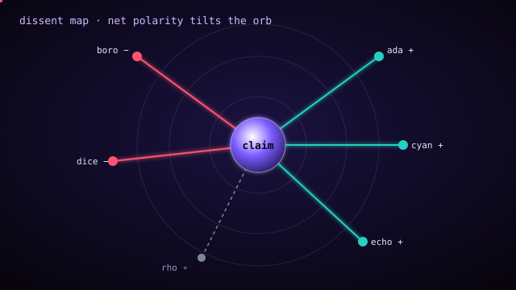

<!-- QuorumForge — a multi-agent evidence adjudication engine. -->

<div align="center">

# ✦ QuorumForge ✦

### *Hold the evidence to the light. Watch the verdict refract.*


**QuorumForge** takes the recorded deliberation of a council of agents — who
supported what, who pushed back, how sure they were, and what they cited — and
passes it through a prism of weighted reasoning. Out the far side come four
clean bands of light: **consensus**, **split**, **contested**, and
**unsupported**. Deterministic. Auditable. Re-derivable by hand.

</div>

---

## The one-paragraph pitch

A council argues. Somebody has to write down what the argument *concluded*.
QuorumForge is that scribe — and, more importantly, that *judge*. It is **not an
agent orchestrator**: it does not run agents, call models, or manage prompts. It
operates purely on the *record* of a deliberation after the debate is over. That
separation is the whole point. Because the engine only reads a static transcript
of positions, its judgements are reproducible: the same evidence file always
yields the same verdict, the same report bytes, and the same integrity digest.
You can commit a verdict to version control and diff it next week.

---

## Why a prism?

White light looks like a single, undifferentiated thing until a prism teases it
apart. A pile of agent opinions is the same: it *feels* like noise until you
separate it by direction and strength. QuorumForge's prism has exactly four
exit angles, and every claim leaves through exactly one of them.

| Band | Glyph | What it means |
|------|:-----:|---------------|
| **Consensus**   | ◆ | Strong agreement with little dissent. Affirmed or negated. |
| **Split**       | ◈ | A real lean, but below the consensus bar. Not yet settled. |
| **Contested**   | ▲ | Meaningful weight on *both* sides. The council is divided. |
| **Unsupported** | ○ | Too little decisive weight to conclude anything at all. |

The "unsupported" band is not a failure mode — it is a finding. Knowing that a
claim has *no* backing is often as valuable as knowing it is true.

---

## Anatomy of the light

QuorumForge is a small, sharp, mixed-language toolkit with no third-party
dependencies on either side of the fence.

```
quorumforge/
├── src/                      Rust core + CLI (std library only)
│   ├── lib.rs                public API and the end-to-end `run`
│   ├── model.rs              Agent / Claim / Position / Deliberation
│   ├── json.rs               a compact, idempotent JSON codec
│   ├── parse.rs              line-oriented (.qf) and JSON parsers
│   ├── normalize.rs          claim canonicalization + clustering
│   ├── adjudicate.rs         the weighted verdict engine
│   ├── bundle.rs             deterministic, digest-stamped bundles
│   ├── report.rs             text + JSON report renderers
│   └── bin/quorumforge.rs    the `quorumforge` command-line tool
├── tests/                    focused Rust integration tests
├── viewer/                   TypeScript council viewer (dependency-light)
│   └── src/                  report model, ANSI + HTML renderers, CLI, tests
├── samples/                  rich sample deliberations (.qf and .json)
├── docs/
│   ├── EVIDENCE.md           the normative input-format reference
│   └── assets/               the two animated SVGs on this page
├── Cargo.toml   Makefile   LICENSE   CHANGELOG.md   .gitignore
└── .github/workflows/ci.yml
```

Two languages, one contract: the Rust core emits a `quorumforge.report.v1` JSON
document, and the TypeScript viewer consumes exactly that schema. Neither side
pulls in a runtime dependency — the Rust crate is standard-library-only, and the
viewer's sole `devDependency` is the TypeScript compiler itself.

---

## Quick start

You need a Rust toolchain (1.74+) for the engine and Node.js (18+) plus npm for
the optional viewer. Nothing else.

```sh
# 1. Build and test the Rust engine.
cargo build --release
cargo test

# 2. Adjudicate a sample deliberation as a console report.
cargo run --release -- adjudicate samples/cache-coherence.qf
```

That last command prints something like:

```text
========================================================================
QUORUMFORGE VERDICT  ::  cache-coherence
Question: Is the distributed write-back cache coherent under concurrent
          writes?
========================================================================
Claims: 5   Consensus: 1   Contested: 1   Split: 2   Unsupported: 1
Council cohesion: 60.1%   Policy: consensus>=0.66, dissent<0.34
------------------------------------------------------------------------
[=] [c1] Writes to a single key are linearizable.
     consensus/affirmed topic=linearizability  polarity=+1.00  mass=4.33  ...
[!] [c2] Writes across multiple keys are linearizable.
     contested/negated topic=linearizability  polarity=-0.24  ...
     dissenting: ada, boro
...
```

---

## The council viewer

The prism is prettiest when you let the viewer render it. Build it once, then
pipe a JSON report straight in.

```sh
# Build the viewer (installs only the TypeScript compiler).
cd viewer
npm install
npm run build
cd ..

# Pipe a JSON report from the engine into the viewer's ANSI renderer.
cargo run --release -- adjudicate --format json samples/cache-coherence.qf \
  | node viewer/dist/cli.js -

# Or produce a standalone, self-contained HTML council page.
cargo run --release -- adjudicate --format json samples/migration-strategy.json \
  | node viewer/dist/cli.js --html - -o council.html
```

The console renderer draws unicode influence meters and colour-codes each
verdict band. The HTML renderer emits a single file with **all** styling inlined
— no remote fonts, scripts, or images — so it opens offline and can be committed
as an artifact.

```sh
# Run the viewer's own test suite.
cd viewer && npm test
```

---

## The command-line tool

```text
quorumforge <command> [options] <evidence-file | ->

COMMANDS
  adjudicate   Parse, normalize, and print a verdict report (text or json).
  bundle       Emit a deterministic, digest-stamped evidence bundle (JSON).
  verify       Re-derive a bundle's digest from its body and confirm it.
  inspect      Print the parsed, normalized deliberation as JSON.
  help         Show usage.

OPTIONS
  --format <text|json>   Report format for `adjudicate` (default: text).
  --consensus <0..1>     Consensus polarity threshold (default: 0.66).
  --dissent <0..1>       Dissent ceiling (default: 0.34).
  --min-mass <n>         Minimum decisive mass to escape unsupported.
  -o, --output <path>    Write output to a file instead of stdout.
  --json                 Treat stdin / extensionless input as JSON.
```

### Real invocations

```sh
# Text report from a line-oriented file.
cargo run -- adjudicate samples/cache-coherence.qf

# JSON report from a JSON deliberation.
cargo run -- adjudicate --format json samples/migration-strategy.json

# See how claim normalization collapses hedged variants.
cargo run -- inspect samples/normalization.qf

# Build a deterministic bundle and verify its integrity digest.
cargo run -- bundle samples/cache-coherence.qf -o bundle.json
cargo run -- verify bundle.json          # -> "digest OK: ..."

# Read from stdin (format assumed .qf unless --json is given).
cat samples/cache-coherence.qf | cargo run -- adjudicate -

# Loosen the policy so a 70/30 lean reads as consensus.
cargo run -- adjudicate --consensus 0.3 --dissent 0.5 samples/cache-coherence.qf
```

Exit codes: `0` success, `2` usage error, `3` parse/validation error, `4` a
`verify` digest mismatch. These make QuorumForge friendly to shell pipelines and
CI gates.

---

## How the prism actually bends light

The scoring model is deliberately simple enough to reproduce with a pocket
calculator. Every non-abstaining position casts a **signed vote**:

```
vote = sign(stance) · agent_weight · confidence
```

with `sign(support) = +1` and `sign(contradict) = −1`. Confidence is clamped to
`[0, 1]` defensively. For a claim, sum the support votes into `S` and the
contradiction magnitudes into `C`, then:

```
decisive_mass = S + C
polarity      = (S − C) / decisive_mass       ∈ [−1, +1]
dissent_ratio = min(S, C) / decisive_mass      ∈ [0, 0.5]
```

`polarity` is *which way* the light bends; `decisive_mass` is *how bright* the
beam is; `dissent_ratio` is *how much* of the beam scatters the other way.

<div align="center">

</div>

The classifier then reads those three numbers against a **policy** (see below):

- **unsupported** if `decisive_mass ≤ minimum_mass`
- **consensus** if `|polarity| ≥ consensus_threshold` **and** `dissent_ratio < dissent_ceiling`
- **contested** if `dissent_ratio ≥ dissent_ceiling`
- **split** otherwise

Finally, the deliberation earns a single **cohesion** score in `[0, 1]`: the
mass-weighted average of each claim's `|polarity|`. A council that agrees loudly
on heavy claims scores near `1.0`; one that is evenly split scores near `0`.

### Worked micro-example

Two agents weigh in on one claim. Ada (weight `1.5`) supports at confidence
`0.8`; Bo (weight `1.0`) contradicts at confidence `0.6`.

```
S = 1.5 · 0.8 = 1.20        C = 1.0 · 0.6 = 0.60
decisive_mass = 1.80
polarity      = (1.20 − 0.60) / 1.80 = +0.333
dissent_ratio = 0.60 / 1.80           =  0.333
```

Under the default policy (`consensus_threshold = 0.66`, `dissent_ceiling =
0.34`): `dissent_ratio 0.333 < 0.34`, so it is not contested; `|polarity| 0.333
< 0.66`, so it is not consensus. The verdict is **split, affirmed**.

---

## Tuning the policy

Three knobs govern classification. All are validated to sensible ranges.

| Knob | Flag | Default | Effect |
|------|------|:-------:|--------|
| `consensus_threshold` | `--consensus` | `0.66` | How lopsided a claim must be to count as consensus. |
| `dissent_ceiling` | `--dissent` | `0.34` | How much losing-side mass tips a claim into "contested". |
| `minimum_mass` | `--min-mass` | `~0` | How much decisive weight is needed to escape "unsupported". |

Raising `consensus_threshold` makes the council harder to satisfy. Lowering
`dissent_ceiling` makes it quicker to flag division. The defaults encode a
familiar rule of thumb: **a two-thirds supermajority with limited dissent reads
as consensus.**

---

## Deterministic bundles

A **bundle** is a canonical, self-contained snapshot of a deliberation *and* its
verdicts, stamped with a content digest (a small, dependency-free FNV-1a hash).
Bundles are byte-stable — the same inputs always produce the same bytes — so
they diff cleanly and can be checksummed in CI.

```sh
cargo run -- bundle samples/cache-coherence.qf -o bundle.json
cargo run -- verify bundle.json
```

The digest covers the *compact* canonical body with object keys in a fixed
order, positions sorted by `(claim, agent, stance)`, and all floating-point
values snapped to a six-decimal grid. That last detail is load-bearing: it makes
the JSON writer **idempotent**, so a bundle survives a round trip through the
parser without changing its digest. Mutate any field and `verify` returns exit
code `4`.

---

## Testing

Both halves ship with focused tests and are exercised together in CI.

```sh
# Rust: unit tests, integration tests, and doctests.
cargo test

# TypeScript: compile, then run the assertion-based renderer suite.
cd viewer && npm test

# Everything, via the Makefile.
make test
```

The Rust suite covers the four verdict outcomes, weight and confidence scaling,
policy tuning, parser error paths, JSON round-trip stability (including unicode
escapes and surrogate pairs), bundle determinism, and tamper detection. The
viewer suite covers report validation, ANSI vs. plain output, HTML escaping, and
render determinism.

---

## Design commitments

- **No orchestration.** QuorumForge judges a transcript; it never runs agents.
- **No dependencies.** Rust core is std-only; the viewer's only build-time
  dependency is `tsc`. There is no `Cargo.lock` churn and no `node_modules`
  supply chain to audit at runtime.
- **Determinism first.** Ordered maps, sorted positions, snapped floats, and an
  idempotent JSON writer mean identical inputs give identical bytes.
- **Auditability over cleverness.** Every intermediate quantity (masses,
  polarity, dissent) is retained in the report so a human can check the math.
- **Offline forever.** No network calls, no remote media, no telemetry.

---

## Limitations

QuorumForge is intentionally narrow. Know the edges before you rely on it.

- **No semantic understanding.** Claim normalization is lexical only — it folds
  hedges and contractions and collapses whitespace. Two claims that *mean* the
  same thing but share no words are treated as distinct. There is no embedding
  model, paraphrase detector, or entailment check, and adding one would break
  determinism.
- **No provenance grading.** Citations are recorded and counted, but their
  *quality* is not assessed. A citation to a rigorous proof and a citation to a
  hunch count the same toward the citation tally. Weight your agents, not your
  sources.
- **Confidence is self-reported.** The engine trusts (after clamping) whatever
  confidence an agent declares. It cannot detect overconfidence or calibration
  drift.
- **Weights are exogenous.** Credibility weights come from the input file.
  QuorumForge does not learn or update them; garbage weights yield garbage
  verdicts.
- **Independence is assumed.** The scoring model treats positions as independent
  votes. It does not detect collusion, duplicated reasoning, or agents that are
  really one source wearing many hats.
- **Single-round.** A deliberation is a static snapshot. There is no notion of
  rebuttal rounds, position changes over time, or convergence dynamics beyond
  what the final transcript records.
- **Numbers are `f64` snapped to six decimals.** This is ample for adjudication
  but is not arbitrary-precision arithmetic; do not treat masses as exact
  rationals.
- **The FNV-1a digest is an integrity fingerprint, not a security hash.** It
  detects accidental drift and casual tampering, not a determined adversary.
  Do not use it as a cryptographic seal.

---

## A note on the two encodings

The line-oriented `.qf` format is built for humans and version control: comments,
one record per line, and clean diffs. The JSON format is built for machines that
generate deliberations programmatically. They are information-equivalent and
converge on the same model — pick whichever fits the hand that writes it. The
full grammar and schema live in [`docs/EVIDENCE.md`](docs/EVIDENCE.md).

---

## License & history

Released under the [MIT License](LICENSE). See [`CHANGELOG.md`](CHANGELOG.md) for
the release history.

<div align="center">

*Bring the argument. QuorumForge brings the light.*

</div>

<!-- docs pass by RozuniFix72: quorum rules table -->
